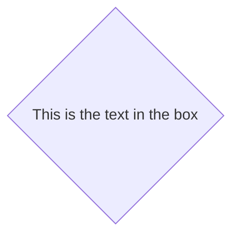

# UML (Unified Modeling Language)

### Merise (entité association)

| Données | Traitements |
| MCD | MCT(action) |
| MLD | MOT(qui réalise les actions) |
| Creation bdd | dev |

## UML vue général

13 diagrames a utiliser au choix
c'est une demarche itérative (non structuré)
Objectif : avoir n diagramme cohérents

### Démarrer la définition de besoins

1. Identifier les acteurs du future produit
   - C'est un diagramme de contexte
   - Il y a les acteurs pricipaux(utilisateurs | \<\<Système\>\>(CRON))
   - Acteurs secondaires - personne - autre système type (API)

Remarque :

- les acteurs pricipaux ce mettent a gauche
- On met les acteurs au singulier

2. Si le sujet est vaste et complexe
   -> Diagramme de packages

3.

- Si le sujet est simple -> alors on fait un diagramme de CV
- Si le sujet est complexe -> alors on fait un diagramme de CV par package
  Question qui doit pouvoir faire quoi
